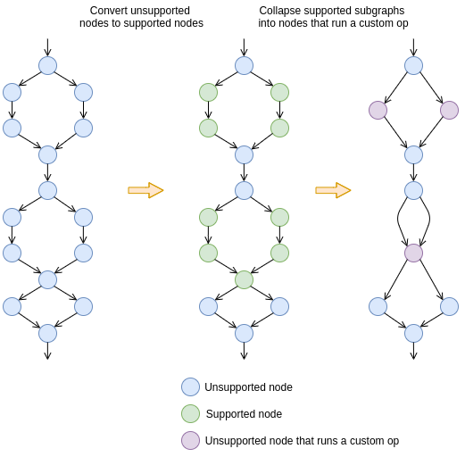
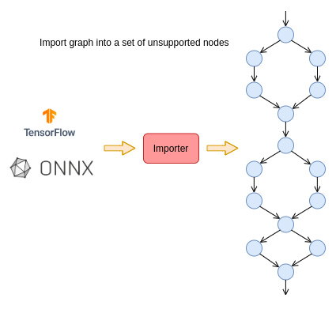
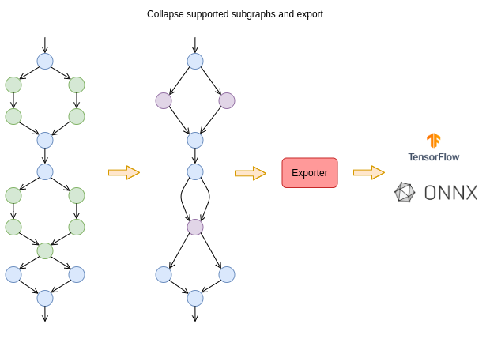
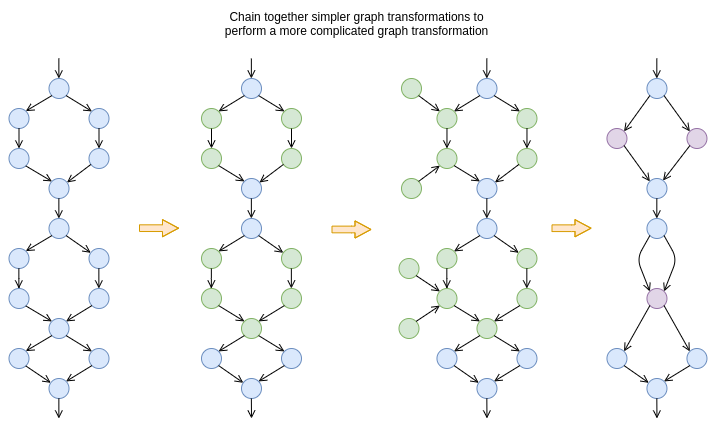
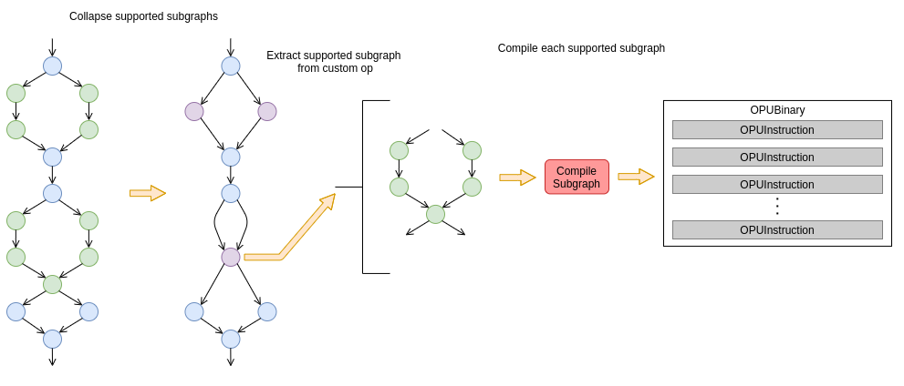
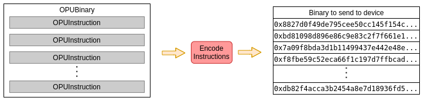
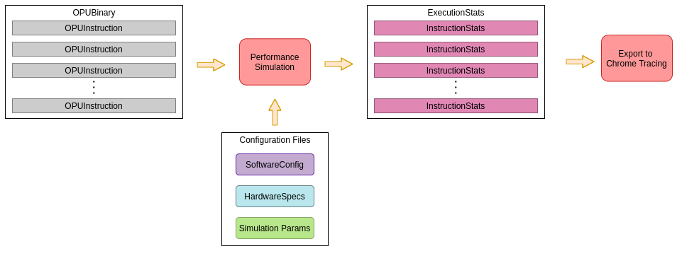
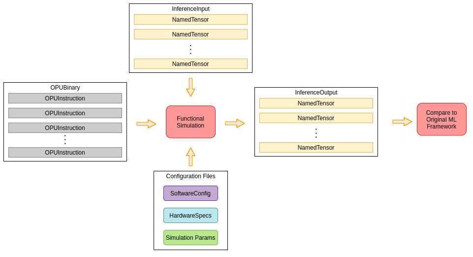

# Concepts

In this section, we provide a high-level overview of some of the modules inside of the Lightelligence SDK (LT SDK) and how they relate to one another.

## Lightelligence Graph Format (LGF)

The LT SDK provides a custom internal graph format called the _Lighelligence Graph Format (LGF)_. The LGF stores the computation graph of a neural network inside of a [Protocol Buffer](https://developers.google.com/protocol-buffers). The protobuf file specifying the detail of
the LGF can be found in [lgf.proto](https://github.com/Lightelligence/SDKDocs/blob/master/lt_sdk/proto/lgf.proto)

Looking inside the protobuf file, we see the LGF structure

```proto
message LGF {
  repeated LNF nodes = 1;
  repeated EdgeInfo input_edges = 3;
  repeated EdgeInfo output_edges = 4;
  repeated string output_node_names = 6;
  MetaGraphInfo meta_graph_info = 5;
}
```

An LGF graph is essentially a collection of nodes in the _Lightelligence Node Format (LNF)_. The LGF includes the inputs and outputs of the graph. The LGF also includes a section for storing extra
meta graph information, which is graph level information that does not belong in any of the nodes.

We have chosen to create LGF for a few reasons

- LGF allows us to more easily perform certain graph transformations
- LGF provides a standardized set of nodes, which the compiler can convert into a set of standardized instructions
- LGF distinguishes which nodes we can send to our device and which nodes must be run on the host
- LGF allows us to more easily expand the LT SDK to a variety of machine learning frameworks (i.e. TensorFlow, ONNX, PyTorch)

### Supported nodes

Every node in an LGF graph is either _supported_ or _unsupported_. A _supported_ node is a node that we support on our device. Specifically, a supported node can be compiled into a set of instructions that runs on our custom hardware. _Unsupported_ nodes are not currently supported on our device. These nodes can be transformed back into nodes inside their original machine learning framework. During inference, these nodes will be run on a host using their original machine learning framework library.

The LT SDK contains sets of default transformations for converting unsupported nodes into supported nodes. For more details about these transformations, see the [graph transformations section](#graph-transformations).

Because some nodes are supported and some are unsupported, the LT SDK also provides code to partition graphs into _supported subgraphs_ and _unsupported subgraphs_. During inference, each supported subgraph will be collapsed into a single node that contains a serialized LGF. This node will be run as a custom operation on the original machine learning framework. This custom operation will run the serialized LGF on our device while unsupported nodes will be run on the host.



### Light Graph

In the LT SDK, we have also provided a wrapper in Python around the LGF protobuf object. We refer to this as a _light graph_. The code for this Python object can be found in [lgf_graph.py](https://github.com/Lightelligence/SDKDocs/blob/master/lt_sdk/graph/lgf_graph.py).

A light graph provides some additional helper methods for accessing certain parts of an LGF protobuf. A light graph is also an _immutable object_ in Python.

A light graph can be initialized from an LGF protobuf object and can be converted back into an LGF protobuf object.

### Importing and Exporting Graphs

Because the LT SDK includes a custom graph format, it also includes sets of _importers_ and _exporters_. An _importer_ converts a graph from a machine learning framework into an LGF graph, returning a light graph. An _exporter_ converts a light graph back into a new graph of its original framework.

Importers convert a set of nodes from a machine learning framework into a set of unsupported nodes. These nodes only become supported during [graph transformations](#graph-transformations). The LT SDK is able to convert every unsupported node back into its original format, in case it cannot be converted into a supported node.



When exporting a graph back into its original framework, we collapse groups of supported nodes into a single node. This single node will represent a custom operation in the original framework. Within this custom operation, we will deserialize an LGF subgraph, and run the LGF subgraph inside of our [functional simulator](#functional-simulation).



## Graph Transformations

The LT SDK provides a set of _graph transformations_. A graph transformation takes in a light graph and outputs a new light graph. The new light graph is the graph you would end up with after performing a set of transformations on the original light graph. We run a set of graph transformations on an imported graph in order to convert it into a new graph that we can compile.

The graph transformations in the LT SDK involve

- A base transformations stage. This stage converts unsupported nodes into supported nodes. This stage also resolves inconsistent data types, folds constants, and removes unnecessary nodes.
- Activation Scale Calibration. This stage runs calibration data through the original graph in order to collect histogram statistics. These histograms are used to determine quantization scales and biases for activations (input data) within the graph. For instance, we quantize the inputs of all matrix multiplications, so this computes the quantization scale and bias used to do these quantizations.
- Fold Phasify Constants. This stage involves folding intermediate nodes created in the base transformations stage into constants.

We have found that the most robust way to perform very complicated graph transformations is to chain together sets of simpler modular graph transformations. Because of this, the LT SDK performs many different stages of graph transformations before a graph is ready to send to the compiler.



## Lightelligence Graph Compiler (LGC)

Once a light graph has gone through a set of transformations, we can _compile_ parts of the graph into a _OPUBinary_ protobuf. This protobuf is defined in [subgraph_binary.proto](https://github.com/Lightelligence/SDKDocs/blob/master/lt_sdk/proto/subgraph_binary.proto). From this file, we see

```proto
message OPUBinary {
  repeated OPUInstruction instr = 1;
}
```

An OPUBinary consists of a set of instructions. Each instruction includes a set of dependencies on other instructions. These dependencies reflect the order in which instructions must be run. Instructions also contain information about how they can be _pipelined_ (running a downstream instruction before its dependency is fully finished).

The _Lightelligence Graph Compiler (LGC)_ converts an LGF protobuf into a set of instructions. In doing so, the LGC sequences the nodes in the graph performs memory allocations for dynamic and static tensors, and compiles each node into a set of instructions.

The LGC may throw errors if there is not enough memory for all memory allocations in a subgraph. The LGC may also fail if certain nodes have been marked supported but cannot actually be run on a given hardware configuration.

In general, a LGC error may indicate a bug within the LGC or a bug in some of the higher-level code. Bugs in the higher-level code may be addressable by editing certain [configuration files](configuration).



### Instruction Encoding

The LGC itself converts an LGF protobuf into an OPUBinary protobuf. However, our actual hardware will not be able to read an OPUBinary. Because of this, we have separate sections of code dedicated to _encoding_ instructions into a binary format that can be read by our hardware.



## Performance Simulation

Once generating a light graph that can be paritioned into supported subgraphs, we can compile each subgraph and run it through the _performance simulation_. The performance simulation is focused on estimating how long each instruction within the OPUBinary will take to run on a specific hardware device.

The performance simulation takes into account how instructions will be pipelined, which data dependencies within the instructions must be obeyed, as well as the resource usage and requirements of the hardware. Because of these data dependencies, only certain groups of instructions can be pipelined together.

The output of the performance simulation is an _ExecutionStats_ protobuf, which can be found in [inference.proto](https://github.com/Lightelligence/SDKDocs/blob/master/lt_sdk/proto/inference.proto). The ExecutionStats protobuf specifies the start time and duration for each instruction that will be run on our device. In general, there will be a one to one mapping between an _InstructionStats_ protobuf that the performance simulation outputs and an _OPUInstruction_ that the LGC creates.



## Functional Simulation

Similar to the performance simulation, the LT SDK also provides a _functional simulator_. The functional simulation runs all of the instructions in an OPUBinary, and simulates how the hardware will manipulate data when running a workload.

Along with a supported subgraph, the functional simulation also requires input data. This input data for a subgraph is specified by a _InferenceInput_ protobuf. This protobuf consists of tensor data along with edge information to specify which edge in the graph corresponds to this tensor.

The output of a functional simulation will be a set of tensors representing the output of a supported subgraph. This tensor data is stored within an _InferenceOutput_ protobuf.

Overall, the functional simulation will tell us what tensors our hardware will output given an LGF subgraph and a set of input tensors. We use the functional simulation in order to determine how close a transformed graph running on our hardware will perform compared to the original graph running on a host device.



## Configuration

In the LT SDK and as part of the API to use the SDK, we have a set of three configuration protobufs.

- The _SoftwareConfig_ protobuf is defined in [sw_config.proto](https://github.com/Lightelligence/SDKDocs/blob/master/lt_sdk/proto/sw_config.proto). This specifies general information about which graph transformations to perform. The SoftwareConfig also contains a set of flags that are used during compilation, performance simulation, and functional simulation.
- The _HardwareSpecs_ protobuf is defined in [hw_spec.proto](https://github.com/Lightelligence/SDKDocs/blob/master/lt_sdk/proto/hw_spec.proto). This specifies information about which hardware configuration to run in the functional simulation and performance simulation. Some of the graph transformations also rely on the HardwareSpecs, as certain transformations depend on things like the bit resolution and matrix size within the hardware.
- The _SimulationParams_ protobuf is defined in [sim_params.proto](https://github.com/Lightelligence/SDKDocs/blob/master/lt_sdk/proto/sim_params.proto). This specifies extra information about how to perform functional simulation and performance simulation. Some of the flags used by the LGC are found in the SimulationParams.

### Multithreading Flags

When running graph transformations and functional simulation, the LT SDK uses multiple threads to speed things up. The flags to specify the number of cores to use during graph transformations are found in the SoftwareConfig. The flags to specify the number of cores to use during functional simulation is found in the SimulationParams.

- `sw_config.num_threads_scales` number of threads to use when computing quantization scales from histograms
- `sim_params.num_runtime_threads` number of threads to use when running the [functional simulation](#functional-simulation). Note that some of the [graph transformations](graph-transformations) include running subgraphs through the functional simulation.

### Debugging Flags

We provide some extra flags for collecting debugging information in the SoftwareConfig.

- `sw_config.debug_info.debug_dir` stores extra debugging information will in the given directory
- `sw_config.debug_info.collect_checksums` collects checksums of the outputs of each instruction in the compiled binary
- `sw_config.sweep_info.convert_graph_to_debug_mode` converts the graph into a mode that collects histograms for the outputs of supported nodes in the graph

## Visualization

We currently make use of two visualization tools in the LT SDK to help understand the outputs of our graph transformations and LGC.

### Graph Visualization

We have created an open source graph visualization tool to visualize neural network computation graphs. The open source code for this can be found on our [GitHub repo](https://github.com/Lightelligence/model_vis).

The graph visualization tool colors different nodes and displays certain information about them. This tool also allows the user to provide a set of histograms for a graph. The tools allow a user to visualize certain histograms corresponding to certain tensors in the graph using a browser.

In the LT SDK, we have added an extension to this graph visualization tool to visualize LGF protobufs.

### Chrome Tracing

In the LT SDK, we also provide tools to convert an ExecutionStats protobuf into a Chrome Tracing file. This file can be opened in the [Google Chrome Browser](https://www.google.com/chrome/) by navigating to the URL [chrome://tracing](chrome://tracing).

We recommend using Chrome Tracing to visualize and better understand the outputs from the performance simulation. It allows the user to see which instructions are being pipelined and how quickly a workload is expected to run on our hardware.

## Supported Operations

We currently only support certain operations on our hardware. Specifically, we have implemented graph transformations that can convert certain unsupported LNF nodes from different machine learning frameworks into supported LNF nodes. The nodes that are transformed are specified by the SoftwareConfig protobuf.

The list of supported operations for each framework can be found in [generate_sw_config.py](https://github.com/Lightelligence/SDKDocs/blob/master/lt_sdk/proto/configs/generate_sw_config.py).
